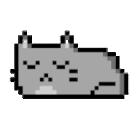
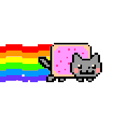

# Neko
Your Floating Desktop Friend!

  

**Neko** is a floating animated cat that lives on your desktop!  
It **sleeps**, **jumps**, and **floats away holding a balloon** when you hover your mouse — and sometimes switches into a chill floating mode! You can even **double-click** to teleport Neko to a new place on your screen! 🐾🎈

---

## ✨ Features

- 😴 Sleeps when idle for 90 seconds (`sleeping_cat.gif`)
- 🐾 Randomly jumps (`jumping_cat.gif`)
- 🎈 Floats with a balloon on hover (`balloon_cat.gif`)
- 🌬️ Occasionally switches to a soft idle floating state (`idle_fly_cat.gif`)
- 🖱️ Double-click to teleport Neko around the screen
- 🖼️ Transparent, always-on-top floating window
- 🎨 Plug-and-play animation customizations
---

## 🎬 Demo

  
  
  
  

---
